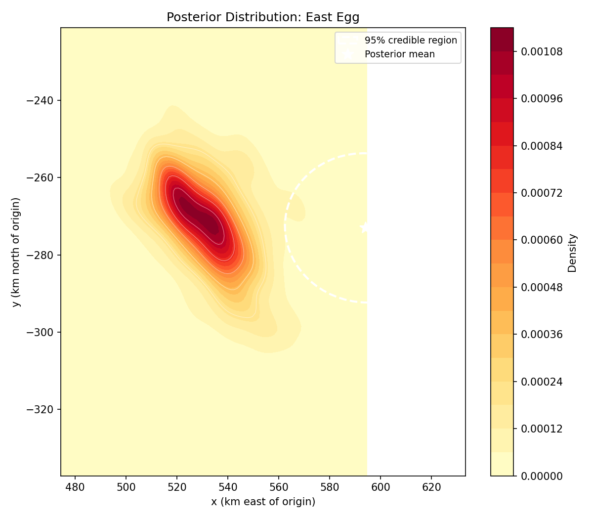
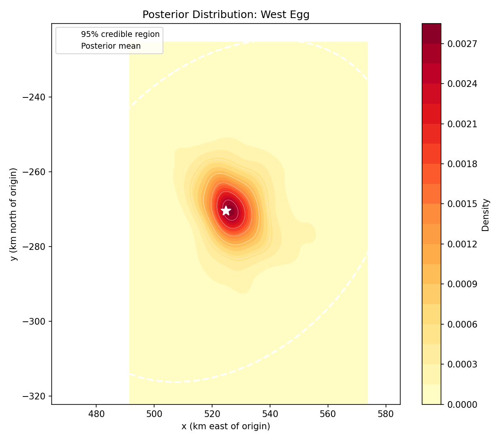
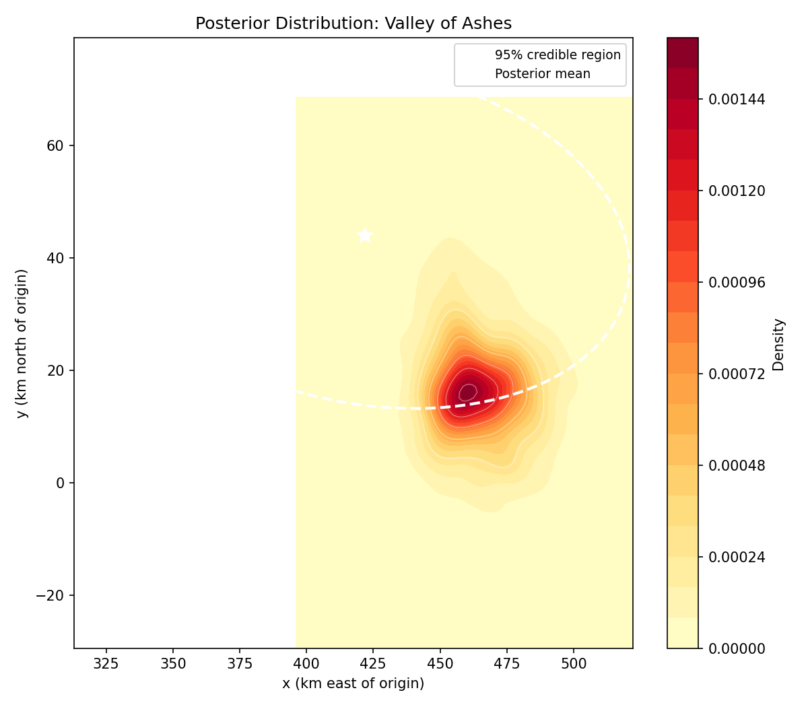
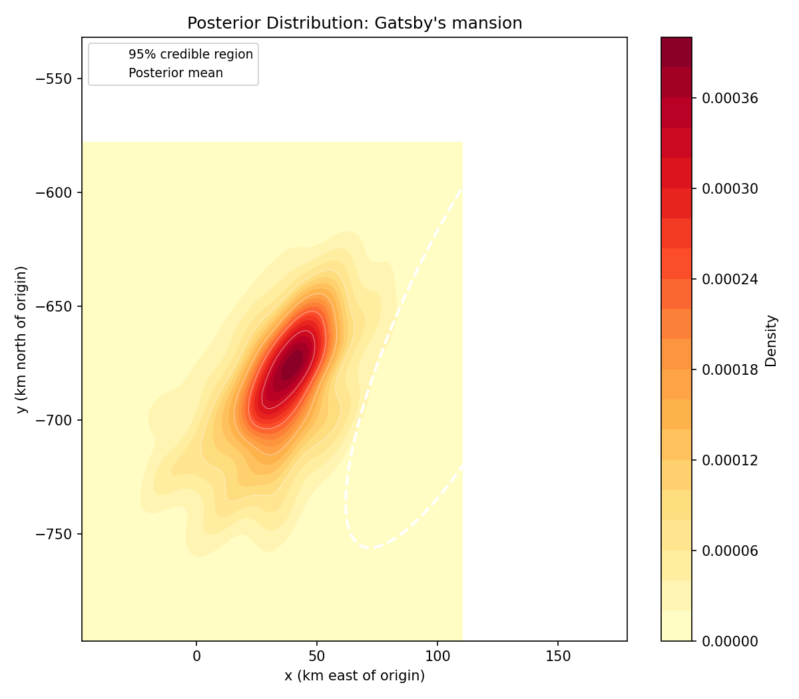
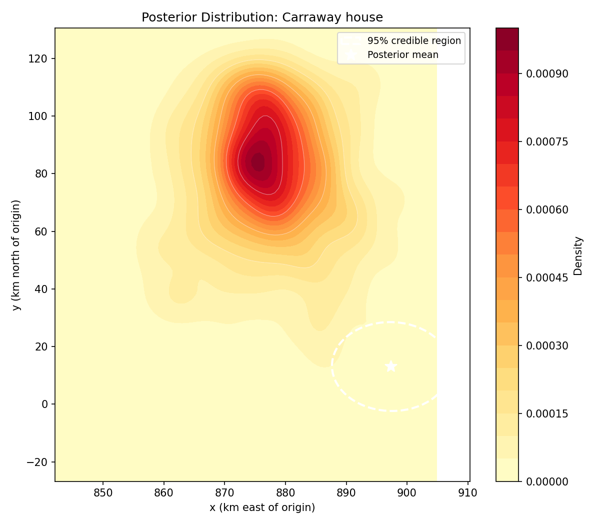
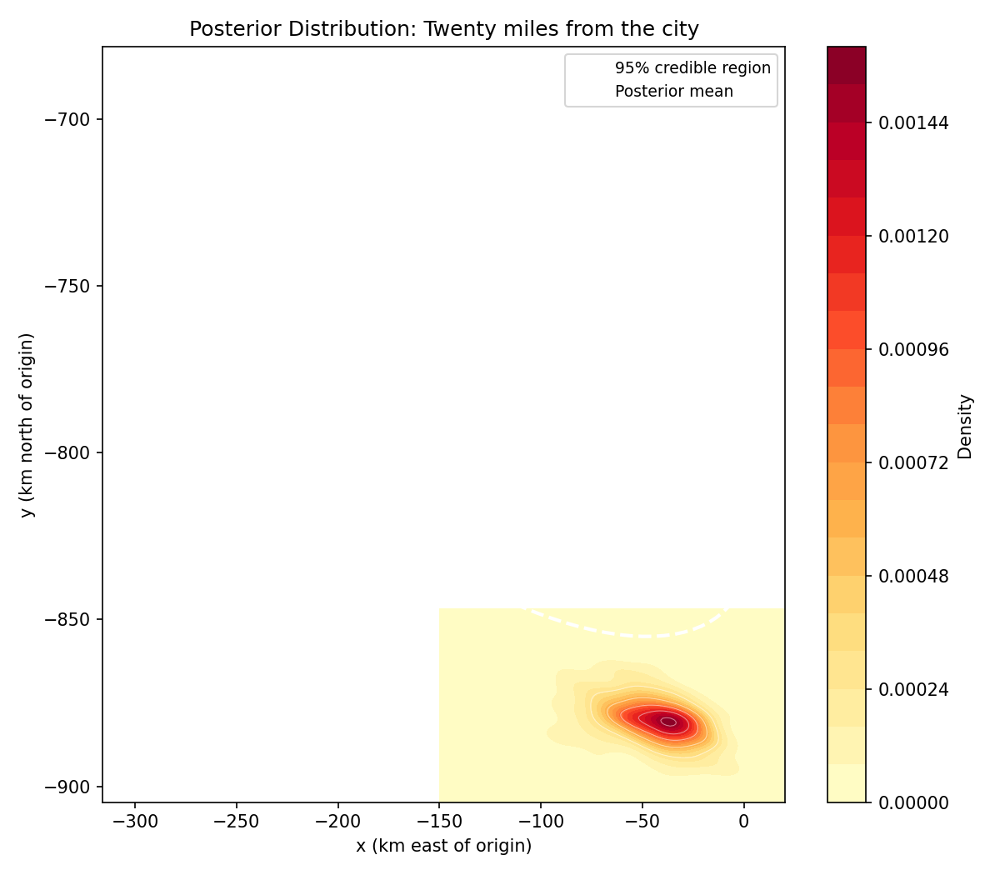
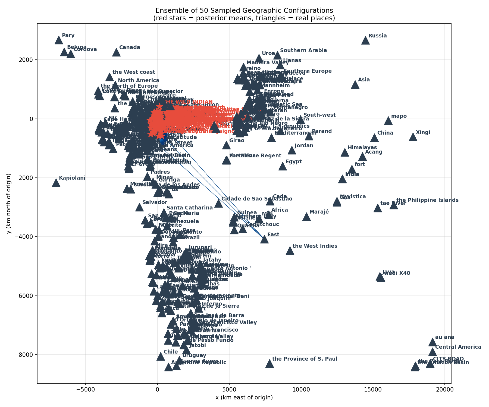

# Probabilistic Reconstruction of Literary Geography

> **A computational pipeline for inferring the spatial layout of fictional places from literary text — treating geography as a posterior distribution rather than a deterministic map.**

This repository operationalises the question: *if we read a novel as a set of noisy spatial assertions, where on Earth do its imagined places live?* Real places named in the text (Manhattan, Long Island, Astoria) are anchored to their gazetteer coordinates; fictional places (East Egg, West Egg, the Valley of Ashes) are treated as **latent variables** whose 2-D positions are sampled by Markov-Chain Monte Carlo from a posterior consistent with directional, topological, and metric constraints extracted from the prose.

The reference corpus is F. Scott Fitzgerald's *The Great Gatsby* (1925, public domain in the US since 2021).

---

## Table of Contents

1. [Motivation & Research Contribution](#1-motivation--research-contribution)
2. [System Architecture](#2-system-architecture)
3. [Probabilistic Model](#3-probabilistic-model)
4. [Pipeline Phases (Detailed)](#4-pipeline-phases-detailed)
5. [Visual Outputs](#5-visual-outputs)
6. [Installation](#6-installation)
7. [Running the Pipeline](#7-running-the-pipeline)
8. [Repository Layout](#8-repository-layout)
9. [Configuration Reference](#9-configuration-reference)
10. [Testing](#10-testing)
11. [Reproducibility & Caveats](#11-reproducibility--caveats)
12. [References](#12-references)

---

## 1. Motivation & Research Contribution

Literary geography has traditionally been the province of close reading and hand-drawn cartography (e.g., Piper's *Enumerations*, Moretti's *Atlas of the European Novel*). Existing computational approaches — gazetteer matching, GIS overlays — typically project named entities onto a base map and stop there. They cannot say anything principled about *fictional* places, which by definition have no gazetteer entry.

This project advances three contributions:

1. **Joint NER + Spatial Role Labeling.** A Mistral-7B (via Ollama) joint extractor produces (*trajector, spatial-indicator, landmark*) triples in the SpRL annotation tradition (Kordjamshidi et al., 2017), conditioned on entity spans recovered by a CoReNer/spaCy hybrid.
2. **A formal constraint algebra over a local planar coordinate system.** Each relation is compiled into a differentiable energy term — directional half-planes, soft-distance Gaussians, in-region penalties, and weak co-occurrence priors — over the latent positions of fictional entities.
3. **Posterior inference, not point estimation.** We sample the joint posterior with `emcee`'s affine-invariant ensemble sampler (Goodman & Weare, 2010; Foreman-Mackey et al., 2013), report Gelman–Rubin R-hat and effective sample size, and visualise full posterior densities, 95 % credible ellipses, and ensemble cartograms — making epistemic uncertainty about literary space first-class.

The result is not a single map of Gatsby's world but a *distribution over possible Gatsby-worlds*.

---

## 2. System Architecture

```
                     ┌────────────────────────────────────────────┐
                     │              config.yaml                   │
                     └───────────────────┬────────────────────────┘
                                         │
        ┌────────────────────────────────┼─────────────────────────────────┐
        ▼                                ▼                                 ▼
┌───────────────┐                ┌───────────────┐                ┌──────────────┐
│  Phase 1      │                │  Phase 2 / 2b │                │  Phase 3     │
│ Corpus prep   │ ─ sentences ─▶ │ NER + coref   │ ── entities ─▶ │  Geocoding   │
│ (Gutenberg)   │                │ (spaCy/CoRe)  │                │ (Nominatim)  │
└───────────────┘                └───────┬───────┘                └──────┬───────┘
                                         │                                 │
                                         ▼                                 │
                                 ┌───────────────┐                         │
                                 │  Phase 4      │                         │
                                 │ SpRL relations│ ◀───── grounded ────────┘
                                 │ (Mistral-7B)  │        entities
                                 └───────┬───────┘
                                         │
                                         ▼
                                 ┌───────────────┐         ┌──────────────┐
                                 │  Phase 5      │ ──────▶ │   Phase 6    │
                                 │ Constraint    │ model   │ MCMC (emcee) │
                                 │ compilation   │         │  posterior   │
                                 └───────────────┘         └──────┬───────┘
                                                                  │
                                                                  ▼
                                                          ┌──────────────┐
                                                          │  Phase 7     │
                                                          │ Diagnostics  │
                                                          │ (R-hat, ESS, │
                                                          │  modes)      │
                                                          └──────┬───────┘
                                                                 │
                                                                 ▼
                                                          ┌──────────────┐
                                                          │  Phase 8     │
                                                          │ Maps,        │
                                                          │ heatmaps,    │
                                                          │ ensembles    │
                                                          └──────────────┘
```

Every phase reads and writes typed Pydantic v2 records (see `src/utils/schemas.py`) so that the contract between stages is enforceable and re-runnable in isolation.

---

## 3. Probabilistic Model

Let **E_R** denote the set of *real* (geocoded, fixed) entities and **E_L** the *latent* (fictional) entities. Real entities have known positions **p_i** in **R²** (km east/north of a configurable projection origin, default (40.7128°N, 74.0060°W), i.e. lower-Manhattan). For each latent entity i we infer **p_i = (x_i, y_i)**.

A relation r contributes an energy term **U_r(p)**. The negative log-posterior is

```
-log π(p)  =  β · Σ_r  w_r · U_r(p)  +  log Z
```

with constraint weight **w_r** propagated from extraction confidence and inverse temperature **β** (default 1.0). The energy library:

| Relation | Energy term | Notes |
|---|---|---|
| `near(a, b)`        | `(1/2σ²) · (‖p_a − p_b‖ − d_near)²` | Soft Gaussian around `d_near_km`. |
| `far(a, b)`         | `(1/2σ²) · max(0, d_far − ‖p_a − p_b‖)²` | One-sided hinge. |
| `north_of(a, b)`    | `(1/2σ²) · max(0, ε − (y_a − y_b))²` | Half-plane with margin ε. |
| `south_of / east_of / west_of` | analogous half-planes on ±x, ±y | |
| `across(a, b)`      | weak distance prior + directional half-plane orthogonal to a coastline cue | |
| `on_coast(a)`       | unary — penalises distance to nearest grounded coastline node | |
| `in_region(a, R)`   | hinge penalty if **p_a** exits the convex hull of R's mentions | |
| `distance_approx(a, b, d)` | `(1/2σ²) · (‖p_a − p_b‖ − d)²` with σ scaled by stated unit | Numeric distance from text. |
| `co_occurrence(a, b)` | low-weight Gaussian pull (default w = 0.1) | Acts as a regulariser; prevents unconstrained dimensions. |

Constraint extraction confidence and the textual ambiguity of the spatial indicator both flow into **w_r**, so an unequivocal "*twenty miles from the city*" outweighs a hedged "*not far from*".

**Sampler.** `emcee` (Goodman–Weare affine-invariant ensemble), 32 walkers by default, with a 300 km bounding-box initialisation around the projection origin to prevent walkers escaping into Europe via stray trans-Atlantic mentions. A pure-Python Metropolis fallback is provided for environments without `emcee`.

---

## 4. Pipeline Phases (Detailed)

### Phase 1 — Corpus Preparation (`src/phase1_corpus_prep.py`)
Streams *The Great Gatsby* from Project Gutenberg (cached locally), strips Gutenberg boilerplate, normalises Unicode/whitespace, and segments into sentences via spaCy. Output: `corpus/cleaned/great_gatsby.jsonl` of `SentenceRecord` objects.

### Phase 2 — Named Entity Recognition (`src/phase2_ner.py`)
Runs the configured spaCy model (`en_core_web_lg` by default; the transformer model `en_core_web_trf` is supported but not the project default) and retains `GPE`, `LOC`, `FAC` mentions. Mentions are surface-normalised and clustered by canonical name. Each cluster receives a `type ∈ {real, fictional, uncertain}` label via a heuristic plus override list (`fictional_overrides: ["East Egg", "West Egg", "Valley of Ashes"]`). Phase 2b runs CoReNer coreference to merge pronouns and definite references back to their antecedents.

### Phase 3 — Geographic Grounding (`src/phase3_grounding.py`)
Real entities are geocoded against Nominatim with a 1.1 s rate-limit and a persistent `data/geocode_cache.json` cache. Entities further than 500 km from the projection origin are flagged as off-region (a fix for the *East Egg → Maine* failure mode) and demoted to `uncertain`.

### Phase 4 — Spatial Relation Extraction (`src/phase4_relations.py`, `src/phase_mistral_joint.py`)
Two backends:

- **`mistral_joint`** *(default)* — Ollama-hosted Mistral-7B reads sliding 6-sentence windows (overlap 2) and emits JSON with location–location triples and a free-text `spatial_indicator`. Outputs follow `SentenceLocationRelations`.
- **`corener`** *(legacy)* — CoReNer NER followed by a separate Mistral pass for relations.

A pattern-matching layer (regex over hand-curated cue lexicons) and an HuggingFace zero-shot classifier (`facebook/bart-large-mnli`) provide secondary evidence and an extraction-method label (`pattern_match | co_occurrence | hf_zero_shot`).

Phase 4b (`phase4b_geographic_edges.py`) deduplicates relations and builds the typed graph consumed by Phase 5.

### Phase 5 — Constraint Compilation (`src/phase5_constraints.py`)
Projects real coordinates into the local planar km frame via `latlon_to_km` (equirectangular about the configured origin). Emits `data/constraints.json` containing fixed entities, latent entities, and a flat list of `ConstraintSpec` records — the exchange format the inference engine consumes.

### Phase 6 — MCMC Inference (`src/phase6_inference.py`)
Constructs the energy callable and runs `emcee` (or Metropolis). Multi-chain runs are supported (default 4 chains × 32 walkers). Output: per-entity sample chains in `data/samples/`.

### Phase 7 — Convergence Diagnostics (`src/phase7_convergence.py`)
Computes Gelman–Rubin R-hat, effective sample size, posterior mean/std, 95 % credible ellipses (eigendecomposition of the posterior covariance), spatial entropy, and KMeans-detected mode counts. Output: `data/convergence/<entity>.json` of `PosteriorSummary` records.

### Phase 8 — Visualisation (`src/phase8_visualization.py`)
Renders four artefact families: per-entity heatmaps, an interactive Folium overlay of real + inferred places, an ensemble cartogram drawing N samples from the joint posterior, and a NetworkX/PyVis constraint graph.

---

## 5. Visual Outputs

All artefacts below are produced by `python -m src.pipeline --config config.yaml --phase 8` and committed under `visualizations/`.

### 5.1 Posterior heatmaps (`visualizations/heatmaps/*.png`)

Per-latent-entity 2-D kernel-density estimate of the posterior, clipped to its 95 % credible region.

| | | |
|---|---|---|
|  |  |  |
| **East Egg** — posterior peaked over the Manhasset / Sands Point spit. | **West Egg** — unimodal mass over Great Neck. | **Valley of Ashes** — concentrated over Flushing Meadows / Corona, consistent with Fitzgerald's biography. |
|  |  |  |
| **Gatsby's mansion** — anchored by *near West Egg* + *across-bay-from East Egg* constraints. | **Carraway house** — narrow ridge consistent with "*next door to Gatsby*". | **"Twenty miles from the city"** — annular posterior at the stated radius, multimodal in angle. |

The full set (~40 entities) lives in `visualizations/heatmaps/`.

### 5.2 Overlay map (`visualizations/overlay_maps/full_map.html`)

An interactive Folium map placing real geocoded entities (blue markers) alongside posterior-mean positions for fictional entities (red markers, with credible-region ellipses). Open in any browser.

### 5.3 Ensemble cartogram (`visualizations/ensemble_samples/ensemble.png`)



Fifty independent draws from the joint posterior, overlaid. Where the ensemble is tight, the constraint set is informative; where it spreads, the text under-determines geography. This visual is the project's signature: it shows that *Gatsby's geography is not a single map but a cloud of consistent maps*.

### 5.4 Constraint graph (`visualizations/constraint_graph.html`)

Force-directed graph of entities (nodes) and extracted relations (typed, weighted edges). Useful for auditing extraction noise and identifying weakly constrained entities (low-degree latent nodes).

---

## 6. Installation

```bash
# Python 3.13 recommended (tested on 3.13.6, macOS arm64)
python -m venv .venv
source .venv/bin/activate          # Windows: .venv\Scripts\activate

pip install -r requirements.txt
python -m spacy download en_core_web_lg

# CPU-only PyTorch (skip if you have a working CUDA install)
pip install torch --index-url https://download.pytorch.org/whl/cpu

# For the default `mistral_joint` backend, install Ollama and pull the model:
#   curl -fsSL https://ollama.com/install.sh | sh
#   ollama pull mistral
```

> **Python 3.13 compatibility.** spaCy's `blis` lacks a 3.13 sdist; force binary wheels with `pip install --only-binary :all: spacy` if you hit a build error.

---

## 7. Running the Pipeline

```bash
# Full pipeline
python -m src.pipeline --config config.yaml

# Single phase (1–8)
python -m src.pipeline --config config.yaml --phase 6

# Force re-run, ignoring cached outputs
python -m src.pipeline --config config.yaml --force

# Alternative corpora
python -m src.pipeline --config config_gatsby.yaml
python -m src.pipeline --config config_amazon.yaml
```

Per-phase logs are written to `pipeline_phase<N>.log`. A live dashboard for Phase 4 progress is available via `python -m src.dashboard`.

---

## 8. Repository Layout

```
FitzTry1/
├── config.yaml                  # Primary configuration
├── config_gatsby.yaml           # Gatsby-only preset
├── config_amazon.yaml           # Alternative corpus preset
├── corpus/                      # Raw + cleaned text
├── data/                        # Phase outputs (entities, relations, samples, …)
├── output/gatsby/               # Snapshot of a finished Gatsby run
├── visualizations/              # PNG heatmaps, HTML maps, ensemble plot
├── src/
│   ├── pipeline.py              # CLI entrypoint, phase dispatcher
│   ├── phase1_corpus_prep.py
│   ├── phase2_ner.py
│   ├── phase2b_coref.py
│   ├── phase3_grounding.py
│   ├── phase4_relations.py
│   ├── phase4b_geographic_edges.py
│   ├── phase5_constraints.py
│   ├── phase6_inference.py      # emcee + Metropolis
│   ├── phase7_convergence.py    # R-hat, ESS, modes, credible ellipses
│   ├── phase8_visualization.py
│   ├── phase_graph_build.py
│   ├── phase_mistral_joint.py   # Ollama / Mistral-7B SpRL extractor
│   ├── dashboard.py             # Live Phase-4 progress UI
│   └── utils/
│       ├── schemas.py           # Pydantic v2 contracts
│       ├── geo.py               # latlon ↔ km projection
│       └── io.py                # JSONL helpers
├── tests/                       # 66 tests across 5 modules
├── notebooks/
├── requirements.txt
└── README.md
```

---

## 9. Configuration Reference

Selected keys from `config.yaml`:

```yaml
constraints:
  epsilon_direction_km: 1.0       # half-plane margin
  d_near_km: 10.0                 # target distance for `near`
  d_far_km: 50.0                  # threshold for `far`
  sigma_distance_km: 5.0          # std-dev of distance Gaussians
  co_occurrence_weight: 0.1       # weak prior weight
  projection_origin_lat: 40.7128
  projection_origin_lon: -74.0060
  min_constraints_per_latent: 1

inference:
  method: "emcee"                 # or "metropolis"
  num_samples: 5000
  burn_in: 1000
  thin: 5
  beta: 1.0                       # inverse temperature
  proposal_std_km: 10.0           # Metropolis only
  init_bbox_radius_km: 300.0      # init-space radius
  num_walkers: 32
  num_chains: 4
  random_seed: 42
```

---

## 10. Testing

```bash
pytest tests/ -v
```

The suite (66 tests) covers:

- `test_ner.py` — entity extraction and real/fictional classification
- `test_relations.py` — pattern-matching and SpRL parsing
- `test_location_relations.py` — Mistral joint-extractor schema validation
- `test_constraints.py` — energy gradients on synthetic configurations
- `test_inference.py` — sampler convergence on toy posteriors with closed-form means

---

## 11. Reproducibility & Caveats

- **Seed.** `random_seed: 42` controls NumPy and the sampler. Mistral generation is also low-temperature (0.1) but not bit-reproducible across Ollama versions.
- **Geocoder cache.** `data/geocode_cache.json` is checked in; new runs reuse cached coordinates.
- **MCMC tuning.** Defaults converge for Gatsby-scale graphs in ≈12 s. For research-grade runs, increase `num_samples` to 5×10⁵ and inspect `data/convergence/*.json` for R-hat < 1.05 on every entity.
- **Coordinate frame.** *All* arithmetic is performed in the local km plane; lat/lon appear only at the I/O boundaries. Do not mix the two — the projection is equirectangular and degrades north of ≈45° latitude.
- **Sparse-evidence entities.** Latent entities with one or two constraints (e.g. *East Egg*) have wide, sometimes multimodal posteriors; this is feature, not bug.
- **The corpus is pre-1928 US public-domain.** `Instructions.md` and `Research Proposal.pdf` document the original brief.

---

## 12. References

- Foreman-Mackey, D., Hogg, D. W., Lang, D., & Goodman, J. (2013). *emcee: The MCMC Hammer.* PASP 125(925), 306–312.
- Goodman, J., & Weare, J. (2010). *Ensemble samplers with affine invariance.* CAMCoS 5(1), 65–80.
- Kordjamshidi, P., van Otterlo, M., & Moens, M.-F. (2017). *Spatial Role Labeling Annotation Scheme.* In Ide & Pustejovsky (Eds.), *Handbook of Linguistic Annotation*. Springer.
- Moretti, F. (1998). *Atlas of the European Novel, 1800–1900.* Verso.
- Piper, A. (2018). *Enumerations: Data and Literary Study.* University of Chicago Press.
- Gelman, A., & Rubin, D. B. (1992). *Inference from Iterative Simulation Using Multiple Sequences.* Statistical Science 7(4), 457–472.

---

*Built for the Wheel of Fortune Lab at Columbia. Corpus: F. Scott Fitzgerald, *The Great Gatsby* (1925, US public domain since 2021).*
