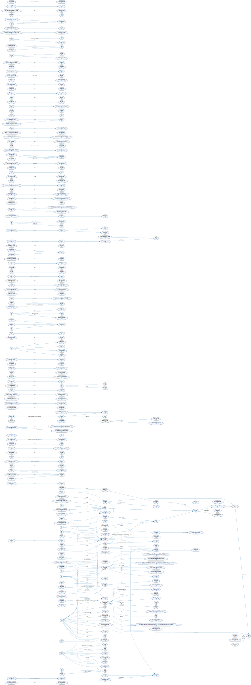

# The Great Gatsby ISO 24617-7 Spatial Graph

> **An automated pipeline that reads a novel and emits an ISO-Space-conformant graph of its spatial relations — extracted by a small open LLM, rewritten into qualitative spatial calculi, and rendered as an interactive diagram.**

This repository takes F. Scott Fitzgerald's *The Great Gatsby* (1925, US public
domain since 2021) and produces a labeled directed multigraph in which:

- **Nodes** are entities mentioned in the prose — places, buildings, regions.
- **Edges** are spatial relations between them — typed with **RCC-8** topology
  (in / contains / overlaps / disconnected / …) and **Cardinal Direction
  Calculus** (N / S / E / W / NE / …) values.
- **Edge labels** are produced by zero-shot Spatial Role Labeling against a
  small open LLM (Mistral-7B via Ollama), then canonicalised by a cue lexicon.

The output is the canonical artefact of the project. The graph follows the
ISO 24617-7 (**ISO-Space**) annotation tradition — a documented, peer-reviewed
schema for spatial annotation — so it is intelligible to other tools and other
researchers without bespoke conventions.



> *The Gatsby spatial graph — 326 nodes, 241 edges. Blue edges are `QSLINK`
> (topological); red edges are `OLINK` (orientation). Open
> [`graphs/corpus/gatsby.html`](graphs/corpus/gatsby.html) for the
> interactive version.*

---

## Table of Contents

1. [What this is](#1-what-this-is)
2. [How the graph is built](#2-how-the-graph-is-built)
3. [The ISO-Space schema](#3-the-iso-space-schema)
4. [Quickstart](#4-quickstart)
5. [Outputs](#5-outputs)
6. [Headline numbers from the *Gatsby* run](#6-headline-numbers-from-the-gatsby-run)
7. [Repository layout](#7-repository-layout)
8. [Installation](#8-installation)
9. [Limitations & honest scope](#9-limitations--honest-scope)
10. [Status of the validation set](#10-status-of-the-validation-set)
11. [Downstream demonstration: probabilistic cartography](#11-downstream-demonstration-probabilistic-cartography)
12. [References](#12-references)

---

## 1. What this is

A two-stage system, both stages reproducible from one command each.

**Stage A — extraction.** Slide a 3-sentence non-overlapping window across the
cleaned corpus, send each window to a local Ollama instance, parse the
returned JSON into structured (*trajector, spatial-indicator, landmark*)
triples in the SpRL annotation tradition (Kordjamshidi, van Otterlo, & Moens,
2017). Output: `data/location_relations.jsonl`, one record per window.

**Stage B — graph compilation.** Read the triples, rewrite the verbatim
spatial indicators into qualitative-calculus values where the cue lexicon
matches, and emit the same graph in three forms:

- **GraphML** — for Gephi, yEd, NetworkX (archival).
- **DOT / SVG** — Graphviz, for paper figures.
- **HTML** — interactive PyVis force-directed view.

Both stages are pure functions of the cleaned corpus and the configured model,
so the graph is fully regenerable from `corpus/cleaned/great_gatsby.jsonl`
in well under an hour.

---

## 2. How the graph is built

```
┌──────────────────────┐     ┌──────────────────────┐     ┌──────────────────────┐
│  corpus/cleaned/     │     │ eval/extract_corpus  │     │ data/location_       │
│  great_gatsby.jsonl  │ ──▶ │  (parallel Ollama,   │ ──▶ │  relations.jsonl     │
│  (2 866 sentences)   │     │   3-sent windows)    │     │  (LocationRelation)  │
└──────────────────────┘     └──────────────────────┘     └──────────┬───────────┘
                                                                     │
                                                                     ▼
                              ┌──────────────────────┐     ┌──────────────────────┐
                              │   eval/to_graph.py   │     │     graphs/corpus/   │
                              │  cue → RCC-8 / CDC   │ ──▶ │   gatsby.{graphml,   │
                              │  rewriter + render   │     │     dot, svg, html}  │
                              └──────────────────────┘     └──────────────────────┘
```

### Stage A — Extraction (`eval/extract_corpus.py`)

For each 3-sentence window we send the same prompt to Ollama:

> *You are a careful annotator extracting LOCATION-LOCATION spatial relations
> from literary prose, following the Spatial Role Labeling (SpRL) annotation
> tradition. … Both `location_1` and `location_2` must be LOCATION spans. …
> If the sentence contains no valid relation, return an empty list. Do NOT
> invent relations. Precision matters more than recall.*

The model is constrained to JSON output (`format: "json"`, `temperature: 0.1`).
Each emitted relation is a triple plus a `semantic_type ⊆ {REGION, DIRECTION,
DISTANCE}`. Default extractor is `mistral` (7 B); the harness is model-agnostic
and tested with `phi3` and `qwen2.5` as well.

The full *Gatsby* corpus is processed in parallel (default 4 workers) and the
output stream is resumable via `--resume`.

### Stage B — Graph compilation (`eval/to_graph.py`)

Each `(location_1, spatial_indicator, location_2)` triple becomes a directed
edge. The verbatim cue is then rewritten:

| Cue regex | RCC-8 (`QSLINK`) | CDC (`OLINK`) |
|---|---|---|
| `inside`, `within`, `in` | `NTPP` | — |
| `contains`, `houses` | `NTPPi` | — |
| `at`, `on`, `part of` | `TPP` | — |
| `next to`, `adjacent`, `bordering`, `near` | `EC` | — |
| `across from`, `opposite`, `far from`, `beyond` | `DC` | — |
| `overlapping`, `crosses` | `PO` | — |
| `north of`, `south of`, `east of`, `west of`, `northeast of`… | — | `N / S / E / W / NE` … |
| `(\d+)\s*(miles?|km…)` | — | — (distance value/unit kept on edge) |

Cues that match **no** pattern are still preserved verbatim on the edge —
nothing is silently dropped, which is essential when feeding the result back
into the prose for close-reading.

---

## 3. The ISO-Space schema

We follow ISO 24617-7 (Pustejovsky, Moszkowicz, & Verhagen, 2015):

| ISO-Space construct | Realisation in our graph |
|---|---|
| `SpatialEntity` / `Place` | Graph node, with `iso_space_type="SpatialEntity"` and `mention_count` attr |
| `QSLINK` (qualitative spatial link) | Directed edge whose `rcc8` attribute holds an RCC-8 value (Randell, Cui & Cohn, 1992) |
| `OLINK` (orientation link) | Directed edge whose `cdc` attribute holds a Cardinal Direction Calculus value (Frank, 1991) |
| `MEASURE` | Edge attributes `distance_value` + `distance_unit` |
| `signal` (verbatim trigger) | Edge attribute `indicator` |

Choosing ISO-Space rather than an ad-hoc schema means the graph is intelligible
to any prior or future SpRL tool, and it sidesteps the bespoke-vocabulary
problem that plagues most "literary network" projects.

---

## 4. Quickstart

```bash
# 0. Bootstrap (see §8 for full installation)
source .venv/bin/activate
ollama pull mistral

# 1. Extract spatial relations from the full corpus (~30 min, 4 workers).
python -m eval.extract_corpus --model mistral --workers 4

# 2. Compile the graph (GraphML + DOT + interactive HTML).
python -m eval.to_graph \
    --in data/location_relations.jsonl \
    --out-dir graphs/corpus --name gatsby

# 3. Render the paper figure.
dot -Tsvg graphs/corpus/gatsby.dot -o graphs/corpus/gatsby.svg

# 4. Open the interactive view.
open graphs/corpus/gatsby.html
```

Use a different model by changing `--model` in step 1 (`mistral`, `phi3`,
`qwen2.5`, anything Ollama serves). Re-run step 2 against the new
`location_relations.jsonl` and you have a graph attributable to that model.

---

## 5. Outputs

After a full run, the canonical artefacts live at:

| Path | What it is |
|---|---|
| `data/location_relations.jsonl` | Per-window LocationRelation records (the source of truth for the graph) |
| `graphs/corpus/gatsby.graphml` | Archival multigraph — open in Gephi / yEd |
| `graphs/corpus/gatsby.dot` | Graphviz source for paper figures |
| `graphs/corpus/gatsby.svg` | Rendered paper figure (`dot -Tsvg`) |
| `graphs/corpus/gatsby.html` | Interactive PyVis force-directed view |

Generated artefacts under `graphs/` are git-ignored; only the JSONL source
of truth is committed. Re-running step 2 reproduces every diagram bit-for-bit.

---

## 6. Headline numbers from the *Gatsby* run

Run on the full 2 866-sentence cleaned corpus, `mistral:latest`, 4 parallel
workers, 37.6 minutes wall-clock:

| Quantity | Value |
|---:|---|
| 3-sentence windows processed | **955** |
| Windows yielding ≥ 1 relation | **171 (17.9 %)** |
| Total `LocationRelation` triples extracted | **241** |
| Errors / parse failures | 2 |
| Graph nodes | **326** |
| Graph edges | **241** |

### Semantic-type distribution (model-emitted)

| `semantic_type` | Count |
|---|---:|
| `REGION` | 112 |
| `DIRECTION` | 80 |
| `DISTANCE` | 35 |
| (untyped) | 12 |

### RCC-8 distribution after cue rewriting

| RCC-8 | Count | Reading |
|---|---:|---|
| `NTPP` | 38 | non-tangential proper part (*"in West Egg"*) |
| `TPP` | 28 | tangential proper part (*"at Gatsby's house"*) |
| `EC` | 13 | externally connected (*"next to the Sound"*) |
| `DC` | 9 | disconnected (*"across the bay from"*) |
| `PO` | 2 | partial overlap |
| `NTPPi` | 1 | inverse NTPP (*"contains a small foul river"*) |
| (verbatim) | 150 | cue not matched by lexicon — kept on edge |

### Most-mentioned entities

`I, New York, Gatsby's house, West Egg, here, Gatsby, the house, my house, East Egg, Chicago` (top 10 by combined trajector + landmark count).

The presence of *I*, *here*, and *Gatsby* in this list reflects an honest
extraction failure mode: the LLM occasionally treats first-person pronouns
or person names as LOCATION spans. A precision-focused post-filter is the
obvious next step.

### Top spatial indicators

`in (13), from (13), on (9), toward (5), over (5), at (4), across the bay (3), …`

The dominance of topological cues (*in*, *on*, *at*) over directional cues
(*toward*, *across*) over metric cues is consistent with *Gatsby* being an
indoor / urban-rooms novel — there are no mountain ranges and very few
*"twenty miles north of"* constructions to extract.

---

## 7. Repository layout

```
FitzTry1/
├── eval/                           ★ extraction + graph builder
│   ├── extract_corpus.py           full-corpus parallel extractor (Ollama)
│   ├── extract.py                  per-sentence extractor (used by the validation harness)
│   ├── to_graph.py                 cue rewriter + GraphML/DOT/HTML emitter
│   ├── sample_sentences.py         random 3-sentence-window sampler (validation set)
│   ├── score.py                    strict + lenient triple-level scoring [deferred]
│   ├── README.md                   eval-specific docs
│   ├── gold/                       100 windows ready for hand annotation [deferred]
│   ├── predictions/                per-model JSONL on the 100-window set
│   └── results/
├── corpus/cleaned/great_gatsby.jsonl     2 866 sentences (Project Gutenberg, cleaned)
├── data/location_relations.jsonl         955 windows × LocationRelation records ★
├── graphs/corpus/gatsby.{graphml,dot,svg,html}   the spatial graph
├── src/                            legacy probabilistic-cartography pipeline (downstream demo, §11)
├── tests/                          66 tests (NER, relations, constraints, inference)
├── config.yaml
└── requirements.txt
```

---

## 8. Installation

```bash
python -m venv .venv && source .venv/bin/activate
pip install -r requirements.txt
python -m spacy download en_core_web_lg
pip install torch --index-url https://download.pytorch.org/whl/cpu  # if no CUDA

# Ollama (extraction backend)
curl -fsSL https://ollama.com/install.sh | sh
ollama pull mistral
ollama pull phi3 qwen2.5   # optional, for cross-model comparison

# Graphviz (for SVG figure rendering)
brew install graphviz   # macOS;  apt-get install graphviz on Debian/Ubuntu
```

Tested on Python 3.13.6 / macOS arm64. If `blis` fails to build on Python
3.13, force binary wheels: `pip install --only-binary :all: spacy`.

---

## 9. Limitations & honest scope

- **Single-corpus, single-author, single-period.** The graph reflects *Gatsby*
  specifically; nothing claimed here generalises to other prose without
  re-running the pipeline.
- **Zero-shot extraction.** No fine-tuning, no in-context examples. Numbers
  are a floor on what each model can do.
- **Person/pronoun leakage.** Mistral occasionally emits people or
  first-person pronouns as LOCATION arguments. Visible in §6 (*I, Gatsby*).
  Filtering by NER type would remove this; not yet implemented.
- **Cue lexicon is hand-curated.** It covers the common English topological
  / directional cues but is not exhaustive. Unmatched cues are preserved
  verbatim, so the only failure mode is "not canonicalised", never "lost".
- **No ground truth.** The 100-window gold set is provisioned but not yet
  annotated (see §10), so RCC-8/CDC counts above are not validated against
  human judgements. Use as descriptive, not as a precision claim.

---

## 10. Status of the validation set

`eval/gold/sentences_to_annotate.jsonl` contains 100 uniformly random
3-sentence windows (seed 42) ready for hand annotation. The accompanying
scoring script `eval/score.py` computes strict + lenient triple-level
P/R/F1, per-`semantic_type` breakdown, and three sentence-level diagnostics
(empty-correct, missed-on-non-empty, hallucinated-on-empty).

The annotation pass is **deferred**. When complete, it will let us:

- Quantify Mistral / Phi-3 / Qwen2.5 precision and recall on this domain.
- Distinguish *conservative* from *hallucinatory* failure modes.
- Position the project as a small **resource paper** for LREC or a digital
  humanities workshop submission.

Until then the graph in §6 is descriptive output, not a benchmark result.

---

## 11. Downstream demonstration: probabilistic cartography

The original project goal — physically locating Fitzgerald's fictional places
on a map of Long Island — is retained in `src/` (Phases 1–8) as a *downstream
demonstration* of one thing you can do with extracted SpRL triples. It runs
`emcee` MCMC over a constraint energy compiled from the relations and emits
posterior heatmaps, ensemble cartograms, and Folium overlays in
`visualizations/`.

The cartographic problem is severely under-determined by the available
textual evidence — *East Egg* has only a handful of usable spatial constraints,
no sampler can pin a 2-D position from such sparse evidence — so the
resulting heatmaps **quantify uncertainty rather than localise**. They are
honest about how much the text actually constrains geography.

The spatial graph in §6 is the right deliverable for the underlying data;
the maps are kept for completeness.

```bash
python -m src.pipeline --config config.yaml   # full Phase 1–8 cartographic run
```

---

## 12. References

- Pustejovsky, J., Moszkowicz, J., & Verhagen, M. (2015). *ISO-Space: Annotating Static and Dynamic Spatial Information.* ISO/TS 24617-7.
- Kordjamshidi, P., van Otterlo, M., & Moens, M.-F. (2017). *Spatial Role Labeling Annotation Scheme.* In Ide & Pustejovsky (Eds.), *Handbook of Linguistic Annotation*. Springer.
- Randell, D. A., Cui, Z., & Cohn, A. G. (1992). *A spatial logic based on regions and connection.* KR '92.
- Frank, A. U. (1991). *Qualitative spatial reasoning about cardinal directions.* Auto-Carto 10.
- Goyal, R. K., & Egenhofer, M. J. (2001). *Similarity of Cardinal Directions.* SSTD 2001.
- Foreman-Mackey, D., Hogg, D. W., Lang, D., & Goodman, J. (2013). *emcee: The MCMC Hammer.* PASP 125(925), 306–312.
- Moretti, F. (1998). *Atlas of the European Novel, 1800–1900.* Verso.
- Piper, A. (2018). *Enumerations: Data and Literary Study.* University of Chicago Press.

---

*Built for an Independent Study in the Columbia Narrative Intelligence Lab. Corpus: F. Scott Fitzgerald,
*The Great Gatsby* (1925, US public domain since 2021).*
