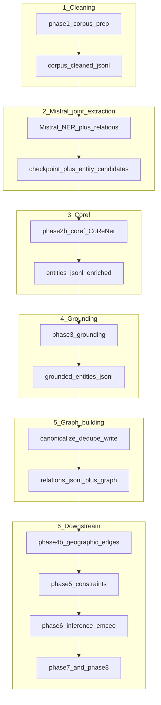

# Mistral NER + Relation Extraction — Strategy B Pipeline

Design specification for restructuring the literary geography pipeline around **explicit named stages**, **joint Mistral extraction** (geographic NER + spatial relations in one Ollama call per chunk), **no static blocklist** on the Mistral path, **CoReNer NER disabled** whenever Mistral performs extraction, and **CoReNer coref** only **after** Mistral output exists.

This document is grounded in: [`src/phase1_corpus_prep.py`](src/phase1_corpus_prep.py), [`src/phase2_ner.py`](src/phase2_ner.py) (CoReNer NER — bypassed in this strategy), [`src/phase2b_coref.py`](src/phase2b_coref.py), [`src/phase3_grounding.py`](src/phase3_grounding.py), [`src/phase4_relations.py`](src/phase4_relations.py) (current Mistral/Ollama client and prompts), [`src/phase4b_geographic_edges.py`](src/phase4b_geographic_edges.py), [`src/phase5_constraints.py`](src/phase5_constraints.py), [`src/phase6_inference.py`](src/phase6_inference.py), [`src/pipeline.py`](src/pipeline.py), [`src/utils/schemas.py`](src/utils/schemas.py).

---

## 1. Canonical pipeline order (Strategy B)

The **intended execution order** is:

1. **Cleaning** — prepare the cleaned sentence corpus.
2. **Mistral relation extraction** — joint **NER + spatial relation** extraction via Mistral (Ollama); **CoReNer is not run** for NER here.
3. **Coref** — cross-span coreference (existing CoReNer-based phase 2b) on the entity registry Mistral produced.
4. **Geographic grounding** — Nominatim (or equivalent) to produce **`grounded_entities.jsonl`**: real vs fictional, lat/lon where resolved, confidence.
5. **Graph building** — after entities are **coreffed and grounded**, canonicalize relation endpoints, apply quality/filtering rules that may depend on coordinates, deduplicate, and persist the **relation graph** (`relations.jsonl` and any merged graph view) used by later stages.
6. **Remaining downstream** — **geographic knowledge edges** (phase 4b), **formal constraint model**, **probabilistic inference** (MCMC-style / **emcee** in [`config.yaml`](config.yaml)), **convergence diagnostics**, **visualization**.

**Rationale (grounding before graph):** In principle one could serialize a purely **textual** relation graph (names + relation types) right after coref, without coordinates. For *this* pipeline, **graph building should follow grounding**: (a) coref stabilizes **which string refers to which place**; (b) grounding assigns **reality, location, and failure modes** (e.g. failed geocode → treat as fictional) that inform which edges are kept, weighted, or passed to [`phase4b_geographic_edges.py`](src/phase4b_geographic_edges.py) and [`phase5_constraints.py`](src/phase5_constraints.py); (c) the prior [`phase4_relations.py`](src/phase4_relations.py) design already used **grounded** mention maps for chunk-level entity lists and quality filters. So: **coref → grounding → graph building** matches both intuition and downstream code.

**Strategy A** (reusing old phase numbers and hiding joint extraction inside the former “Phase 4” module without renaming) is **out of scope** for this design. Implementation should adopt **first-class stage names**, a **single explicit ordered list** in [`src/pipeline.py`](src/pipeline.py), and **dashboard / CLI labels** that match this order.

---

## 2. Mapping: conceptual stages ↔ current modules (target)

| Order | Conceptual stage | Role | Typical module / artifact (target) |
|------:|------------------|------|--------------------------------------|
| 1 | Cleaning | Sentence-segmented corpus | `phase1_corpus_prep` → `corpus/cleaned/*.jsonl` |
| 2 | Mistral extraction | Joint `{entities, relations}` per chunk; checkpoint | New or renamed module (e.g. `phase_mistral_joint`); **not** CoReNer Phase 2 |
| 3 | Coref | Enrich `entities.jsonl` with coref mentions | `phase2b_coref` (CoReNer **coref only**; requires prior `entities.jsonl`) |
| 4 | Geographic grounding | Geocode / classify entities | `phase3_grounding` → `grounded_entities.jsonl` |
| 5 | Graph building | Finalize `relations.jsonl` using **grounded**, coreffed entities | New step or subphase after grounding |
| 6+ | Downstream | Geo edges, constraints, inference, diagnostics, viz | `phase4b_geographic_edges` → `phase5_constraints` → `phase6_inference` → `phase7_convergence` → `phase8_visualization` |

---

## 3. What changes vs today’s default pipeline

Today ([`pipeline.py`](src/pipeline.py)): Phase 2 (CoReNer NER) → 2b (coref) → 3 (grounding) → 4 (Mistral **relations only**, entity list from grounded mentions) → 4b → 5 → 6 → 7 → 8.

Under Strategy B:

- **Phase 2 (CoReNer NER) is omitted** when Mistral owns extraction.
- **Mistral runs before coref** and produces **`entities.jsonl`** (from model NER) plus relation candidates.
- **Coref** runs on that entity registry, then **grounding** produces **`grounded_entities.jsonl`**.
- **Graph building** runs **after** coref and grounding, merging canonical names, grounded identity, and relation tuples into stable **`relations.jsonl`** (and related graph artifacts).

---

## 4. Target architecture (diagram)

---

## 5. Goals (constraints)

- **Joint extraction:** One Mistral (Ollama) call per chunk returns structured **entities** + **relations** (extend the existing `format: json` pattern in [`phase4_relations.py`](src/phase4_relations.py)).
- **No explicit blocklist** on the Mistral path: do not depend on `_ENTITY_BLOCKLIST` / Phase 2 `ENTITY_BLOCKLIST`–style deny lists; use model output, deduplication, confidence, and downstream thresholds. Legacy blocklists may remain only for **non-Mistral** code paths if kept for comparison.
- **CoReNer NER off** whenever Mistral performs extraction; **CoReNer coref** (phase 2b) remains, **after** Mistral, on `entities.jsonl`.
- **Graph building** sits **after** coref and grounding and **before** geographic knowledge edges, constraints, and inference: it is the step that commits the **textual spatial graph** in a form consistent with **grounded** entity identities (not before Nominatim).

---

## 6. Joint Mistral I/O contract

### 6.1 Single JSON object per chunk

- **`entities`:** Geographic mentions with spans mappable to [`SentenceRecord`](src/utils/schemas.py) IDs (`sentence_id`, `char_start`, `char_end`, …) for building [`Entity`](src/utils/schemas.py) / [`EntityMention`](src/utils/schemas.py).
- **`relations`:** Same relation fields as today (`entity_1`, `relation_type`, `entity_2`, `confidence`, `evidence`, optional distances), with endpoints tied to entities in the same response (or explicit local IDs).

### 6.2 Prompt rules

- **Discovery:** Entities that plausibly support spatial reasoning; **no** mandatory static blocklist in post-processing for joint mode.
- **Relations:** Only between declared entities (or explicit ID links); verbatim **evidence**; nullable `entity_2` only where the taxonomy allows (see `NULLABLE_ENTITY2_TYPES` in [`phase4_relations.py`](src/phase4_relations.py)).

Reuse **`OllamaClient`**, retries, checkpointing, and dashboard progress patterns from [`phase4_relations.py`](src/phase4_relations.py); extend checkpoints to hold **both** relation lists and entity materialization state.

---

## 7. Coref (stage 3)

[`phase2b_coref`](src/phase2b_coref.py) expects existing [`Entity`](src/utils/schemas.py) rows with `canonical_name`. Mistral-derived entities must be **deduplicated** to stable canonical strings before coref. **`skip_phase2b_coref`** should default to **false** in joint mode so coref runs.

---

## 8. Graph building (after coref + grounding)

**Graph building** means:

- Inputs: **coreffed** `entities.jsonl` (or equivalent) and **`grounded_entities.jsonl`**, plus relation candidates from the Mistral phase (checkpointed).
- Apply **coref-resolved** canonical names to relation endpoints; use **grounding** to know real vs fictional and which entities have coordinates (for filtering, weighting, or dropping edges).
- Deduplicate relations (existing `_deduplicate` logic or successor).
- Write **`relations.jsonl`** as lists of [`SpatialRelation`](src/utils/schemas.py).

Quality filtering that today lives in `_is_quality_entity` (coordinates + mention counts, etc.) is naturally applied **using grounded data** before or during this stage, without relying on a static blocklist for the Mistral path.

---

## 9. Downstream (after graph building)

| Step | Module | Purpose |
|------|--------|---------|
| Geo edges | `phase4b_geographic_edges` | Real↔real + anchor constraints (expects grounded entities) |
| Constraints | `phase5_constraints` | Formal constraint model |
| Inference | `phase6_inference` | Probabilistic positioning (**emcee** ensemble MCMC in config) |
| Convergence | `phase7_convergence` | Diagnostics |
| Visualization | `phase8_visualization` | Maps / outputs |

---

## 10. Config surface (proposed)

- `ner.backend: mistral_joint` (or equivalent) → **skip CoReNer NER** in [`pipeline.py`](src/pipeline.py).
- `relations.mistral.*` — host, model, chunk size, checkpoint paths (align with current [`config.yaml`](config.yaml) `relations.mistral`).
- Dashboard and `--phase` numbering updated to match Strategy B stage list.

---

## 11. Risks and mitigations

| Risk | Mitigation |
|------|------------|
| Larger JSON payloads | Split validation for `entities` vs `relations`; salvage parse; retries |
| Phase index drift | Single `PHASES` list in `pipeline.py` with names matching §1 |
| Coref without entities | Materialize `entities.jsonl` before calling `phase2b_coref` |

---

## 12. Implementation checklist

1. Introduce Strategy B **phase list** and names in [`pipeline.py`](src/pipeline.py); remove dependence on old 1→2→2b→3→4 order for the Mistral-first path.
2. Implement **joint Mistral** module (or refactor [`phase4_relations.py`](src/phase4_relations.py) into extraction vs graph-finalize) emitting **`entities.jsonl`** + checkpoints.
3. Run **coref** after entities exist; run **grounding**; then **graph building** writing final **`relations.jsonl`**.
4. Wire **downstream** in order: **4b → 5 → 6 → 7 → 8** (grounding is **before** graph building, not here).
5. Update **dashboard** progress assumptions if phase IDs or progress files change.
6. Tests: fixture chunk with joint JSON; end-to-end smoke through **coref → grounding → graph** then downstream.

---

## 13. Out of scope

- Fine-tuning Mistral.
- Replacing CoReNer coref with an LLM (optional future work).
- **Strategy A** dual-path documentation — not maintained here.
